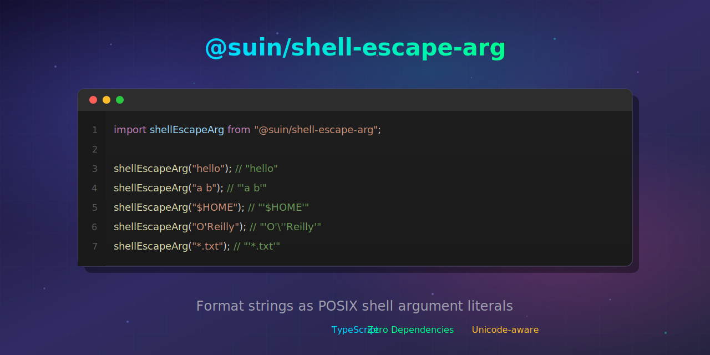

# @suin/shell-escape-arg



[](https://www.npmjs.com/package/@suin/shell-escape-arg)
[](https://www.npmjs.com/package/@suin/shell-escape-arg)
[](https://opensource.org/licenses/MIT)
[](https://www.typescriptlang.org/)
[](https://www.npmjs.com/package/@suin/shell-escape-arg)
[](https://suin.github.io/shell-escape-arg/)

Format strings as POSIX shell argument literals.

> **Warning**: This library is for **display and formatting purposes only**. Do NOT use it to build commands for actual shell execution. If you need to execute commands safely, use proper APIs like `execFile()` with argument arrays, or dedicated security-focused libraries.

## Use Cases

This library is intended for:

- **Displaying commands in logs or UIs** – Show users what a command would look like
- **Generating documentation** – Create example shell commands in docs
- **Testing and debugging** – Format arguments for visual inspection
- **Code generation** – Generate shell scripts for review (not direct execution)

## Features

- **Zero dependencies** – Lightweight
- **Unicode-aware** – Handles Unicode whitespace (NBSP, ideographic space, etc.)
- **TypeScript-first** – Full type definitions included
- **Minimal formatting** – Safe strings pass through unchanged

## Installation

```bash
# npm
npm install @suin/shell-escape-arg

# bun
bun add @suin/shell-escape-arg

# pnpm
pnpm add @suin/shell-escape-arg
```

## Quick Start

```typescript
import shellEscapeArg from "@suin/shell-escape-arg";

// Safe strings pass through unchanged
shellEscapeArg("abc"); // "abc"
shellEscapeArg("日本語"); // "日本語"

// Strings with spaces or special chars are quoted
shellEscapeArg("a b"); // "'a b'"
shellEscapeArg("$HOME"); // "'$HOME'"
shellEscapeArg("*.txt"); // "'*.txt'"

// Single quotes are escaped with '\''
shellEscapeArg("O'Reilly"); // "'O'\\''Reilly'"

// Empty string becomes ''
shellEscapeArg(""); // "''"

// Leading tilde is quoted to prevent expansion
shellEscapeArg("~user"); // "'~user'"
```

## Example: Logging Commands

```typescript
import shellEscapeArg from "@suin/shell-escape-arg";

function logCommand(program: string, args: string[]): void {
    const formatted = args.map(shellEscapeArg).join(" ");
    console.log(`Would run: ${program} ${formatted}`);
}

logCommand("grep", ["-r", "hello world", "*.txt"]);
// Output: Would run: grep -r 'hello world' '*.txt'
```

## Example: Generating Documentation

```typescript
import shellEscapeArg from "@suin/shell-escape-arg";

function generateInstallDocs(packageName: string): string {
    return `
## Installation

\`\`\`bash
npm install ${shellEscapeArg(packageName)}
\`\`\`
`;
}
```

## Formatting Rules

The library uses POSIX single-quote formatting:

| Input      | Output          | Reason                           |
| ---------- | --------------- | -------------------------------- |
| `abc`      | `abc`           | Alphanumeric – no quoting needed |
| `日本語`   | `日本語`        | Unicode text – no quoting needed |
| `a b`      | `'a b'`         | Contains space – quoted          |
| `$HOME`    | `'$HOME'`       | Contains `$` – quoted            |
| `*.txt`    | `'*.txt'`       | Contains `*` – quoted            |
| `O'Reilly` | `'O'\''Reilly'` | Contains `'` – escaped as `'\''` |
| ``         | `''`            | Empty string – quoted            |
| `~user`    | `'~user'`       | Starts with `~` – quoted         |

### Why Single Quotes?

Inside POSIX single quotes, **everything is literal** except the single quote itself:

- `$VAR` stays as `$VAR`
- `` `cmd` `` stays as `` `cmd` ``
- `\n` stays as `\n`
- `*` stays as `*`

## When Quoting is Applied

The library quotes strings that contain:

- **Empty string** – Would disappear without quotes
- **Unicode whitespace** – Space, tab, newline, NBSP, ideographic space (U+3000), etc.
- **ASCII control characters** – U+0001–U+001F, U+007F
- **Shell meta-characters** – `` ' " \ $ ` | & ; < > ( ) * ? [ ] { } ! # ``
- **Leading tilde** – Would trigger tilde expansion

## Error Handling

```typescript
import shellEscapeArg from "@suin/shell-escape-arg";

// Throws TypeError for non-string input
shellEscapeArg(123); // TypeError: escape: arg must be a string
shellEscapeArg(null); // TypeError: escape: arg must be a string

// Throws Error for NUL character (cannot exist in POSIX arguments)
shellEscapeArg("a\0b"); // Error: escape: arg must not include NUL (\u0000)
```

## Limitations

### Single Argument Only

This library formats a **single argument**. It does not parse or build command lines.

### POSIX Format Only

Produces output for POSIX-compatible shells (sh, bash, zsh, dash, ksh). Not suitable for:

- Windows cmd.exe
- PowerShell

### Not for Execution

This library does **not** provide security guarantees. For executing commands:

```typescript
// ✓ Use execFile with argument arrays (no shell involved)
import { execFile } from "child_process";
execFile("grep", ["-r", pattern, filename]);

// ✓ Use Bun's $ with template literals (handles escaping internally)
import { $ } from "bun";
await $`grep -r ${pattern} ${filename}`;

// ✗ Do NOT use this library for execution
import { exec } from "child_process";
exec(`grep ${shellEscapeArg(pattern)} ${shellEscapeArg(filename)}`); // Don't do this
```

## API Reference

See the full [API documentation](https://suin.github.io/shell-escape-arg/).

## License

MIT

## Contributing

Issues and pull requests are welcome on [GitHub](https://github.com/suin/shell-escape-arg).
